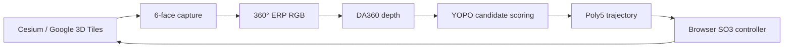

# MindCloud World Fly

> **English summary.** MindCloud World Fly is a browser-based UAV simulator
> built on CesiumJS and Google Photorealistic 3D Tiles. It supports manual
> flight, six-face-to-ERP 360° RGB capture, experimental DA360 depth, and an
> experimental DA360 → YOPO → polynomial-trajectory autonomy loop. The
> autonomous stack is a sim-to-sim research baseline: its metric-depth accuracy
> gate has **not** passed, sustained 15 Hz operation is **not** validated, and
> it is not approved for real flight.

基于 CesiumJS 和 Google Photorealistic 3D Tiles 的浏览器无人机仿真器。项目在原有
手动飞行基础上加入了机载 360° ERP 全景、DA360 深度估计以及 YOPO 局部规划实验链。


## 功能状态

| 能力 | 状态 | 说明 |
| --- | --- | --- |
| 手动飞行 | 可用 | 键盘、Gamepad、WebHID；第一/第三人称；Easy、FPV、Level、SO3 模式 |
| 360° ERP RGB | 可用 | Cesium 六面渲染后在 GPU 中重投影为等距柱状图 |
| DA360 相对深度 | 实验性 | 用于预览，不提供稳定的米制尺度，不授权 YOPO 规划 |
| DA360 metric + YOPO | 实验性 | 仅 sim-to-sim；自动精度门禁失败，当前为人工保留的基线 |
| 持续 15 Hz 闭环 | 未验收 | 有评估器和时序约束，但尚无通过的公开实机 GPU 验收结果 |
| 真实飞行 | 不支持 | 没有真实环境泛化、安全性或飞行认证 |

## 前置条件

- Python 3.10+、Git、curl 和 Docker Engine
- Chrome、Chromium 或 Firefox 等现代浏览器
- 可访问 Cesium Ion 与 Google Photorealistic 3D Tiles 的网络
- 深度/自治链需要 NVIDIA GPU、驱动和 NVIDIA Container Toolkit
- 自治依赖约 1.5 GB 模型文件；模型不会进入 Git

创建自己的 Cesium Ion token，并在启动前注入：

```bash
export CESIUM_ION_TOKEN='your-restricted-token'
```

token 不写入源码、URL 或日志。请在 Cesium Ion 控制台限制可访问资产、允许的 URL，
并只授予所需 scope。不要把 `.env`、终端输出或真实 token 提交到仓库。

## Quick Start

### 1. 手动飞行

```bash
./scripts/bootstrap.sh web
export CESIUM_ION_TOKEN='your-restricted-token'
./launch.sh --local
```

打开 <http://127.0.0.1:8080>。也可运行 `./launch.sh` 使用 Web Docker
入口；容器端口只绑定到 `127.0.0.1`。

### 2. DA360 相对深度

```bash
python3 -m pip install --user gdown
./scripts/bootstrap.sh autonomy
DA360_DEPTH_MODE=da360-relative ./scripts/start_da360_api.sh
```

健康检查：

```bash
curl http://127.0.0.1:5688/health
```

相对深度只用于可视化预览，不会授权自动轨迹规划。

### 3. 实验性自治链

```bash
python3 -m pip install --user gdown
./scripts/bootstrap.sh autonomy
./scripts/build-autonomy-image.sh
export CESIUM_ION_TOKEN='your-restricted-token'
./start-all.sh
```

`start-all.sh` 默认使用 `da360-metric` 和仓库中的脱敏标定参数。启动终端会明确
提示：该标定未通过自动精度门禁，只能作为 sim-to-sim 实验基线。模型路径可覆盖：

```bash
DA360_MODEL_PATH_HOST=/path/to/DA360_large.pth \
YOPO_MODEL_PATH_HOST=/path/to/epoch10.pth \
./start-all.sh
```

停止服务：

```bash
./stop-all.sh
```

Linux + NVIDIA 用户可选用 `./launch-firefox-gpu.sh` 启动 Firefox；这不是通用浏览器
要求。

更完整的安装、端口和配置说明见 [docs/setup.md](docs/setup.md)。

## 基本操作

1. 点击 **Start Google 3D Tiles Flight**。
2. 搜索城市或地点，按住 `I` 点击地面或建筑设置出生点。
3. 使用 `W/A/S/D` 微调位置，设置高度后按 `O` 确认。
4. 选择第一或第三人称并开始飞行。

| 输入 | 操作 |
| --- | --- |
| `↑` / `↓` | 前进 / 后退 |
| `←` / `→` | 左右平移 |
| `W` / `S` | 上升 / 下降 |
| `A` / `D` | 左右偏航 |
| `Shift` | 加速或快速微调 |
| `R` | 重置 |
| `V` | 切换视角 |
| `P` | 返回放置模式 |
| `Tab` | 打开设置面板 |

到达目标不仅要求进入 4 m 半径，还要求三维速度不高于 0.75 m/s，并连续停稳
0.4 s；高速穿过目标球不会被判定为到达。

## 架构



- Web：`scripts/serve.py`，默认 `127.0.0.1:8080`
- Combined API：`scripts/combined_server.py`，默认 `127.0.0.1:5688`
- 前端生命周期：loading → placement → view-select → flight
- 坐标：Cesium ECEF/ENU 映射到仿真本地 `x=east, y=up, z=north`
- 规划入口：`/yopo/plan_full`；深度入口：`/depth`

设计细节见 [docs/architecture.md](docs/architecture.md)。

## 验证

```bash
# 公开树与隐私审计
python3 scripts/audit_public_tree.py

# JavaScript 单元/契约测试
for test_file in tests/*.js; do node "$test_file"; done

# 非 GPU Python 测试
python3 -m pip install -r requirements-dev.txt
PYTEST_DISABLE_PLUGIN_AUTOLOAD=1 python3 -m pytest -q

# 已下载依赖与模型校验
python3 scripts/verify_dependencies.py
```

GPU backend contract 与在线集成测试需要构建好的镜像和实际服务。测试方法、当前门禁
结果和报告边界见 [docs/evaluation.md](docs/evaluation.md)。

## 已知限制

- 当前 metric 标定的 median/p90 AbsRel 分别为 0.376/1.507，10 m 内 p90
  绝对误差为 4.054 m，未达到自动门禁。
- DA360 输出本质上是尺度不变视差；固定尺度不能替代逐场景真实性验证。
- `cesium-truth` dense depth 与 `/yopo/plan_depth` 仍未实现。
- Google Tiles 的网络、缓存与画面就绪状态会影响全景捕获延迟和内容完整性。
- 尚未证明持续 15 Hz 闭环，也未进行真实低空飞行验证。
- 本项目是研究仿真工具，不应用于真实飞行控制或安全关键决策。

## 安全与数据

- Web 和推理端口默认仅绑定 loopback；不要直接暴露到公网。
- Cesium token 由 `/runtime-config.js` 在运行时生成，响应为 `no-store`。
- 飞行日志可能包含完整姿态轨迹、浏览器和设备信息，默认由 `.gitignore` 排除。
- 原始标定 RGB、NPZ/NPY、位姿、anchors、manifest 和模型权重均不公开。
- `config/calibration/da360-v1/` 只保留运行参数和脱敏聚合统计。
- 发现安全问题请按 [SECURITY.md](SECURITY.md) 私下报告。

## 上游、引用与许可证

本项目基于 [superboySB/MindCloud_World_Fly](https://github.com/superboySB/MindCloud_World_Fly)，
其上游为 ManifoldTechLtd 的原始项目。深度与规划能力使用或改编了：

- [CesiumJS](https://github.com/CesiumGS/cesium)
- [PlayCanvas Engine](https://github.com/playcanvas/engine)
- [DA360](https://github.com/Insta360-Research-Team/DA360)
- [YOPO_360_X5_PR](https://github.com/cn-ryw/YOPO_360_X5_PR)

项目代码按 [Apache License 2.0](LICENSE) 发布。第三方软件和资产归属见
[NOTICE](NOTICE)、[asset/ATTRIBUTION.md](asset/ATTRIBUTION.md) 与
[third_party/YOPO/README.md](third_party/YOPO/README.md)。Google Photorealistic
3D Tiles、Cesium Ion 及相关数据服务另受各自条款约束。
