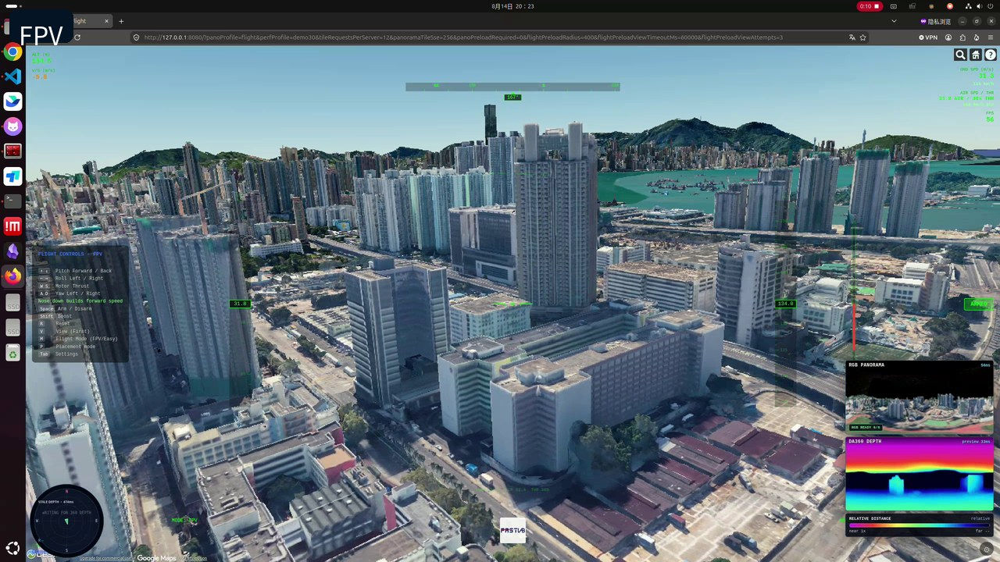
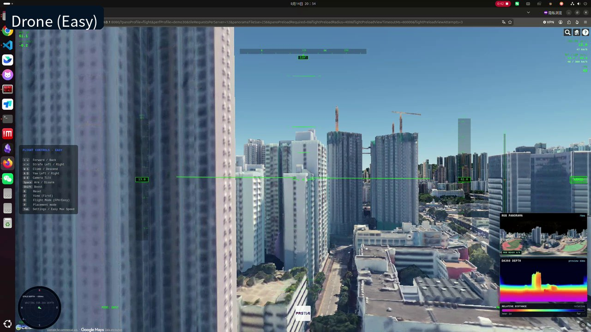
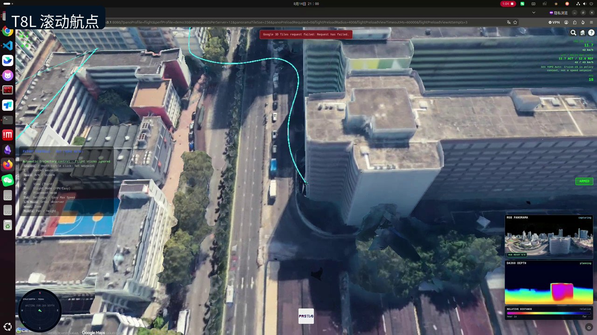
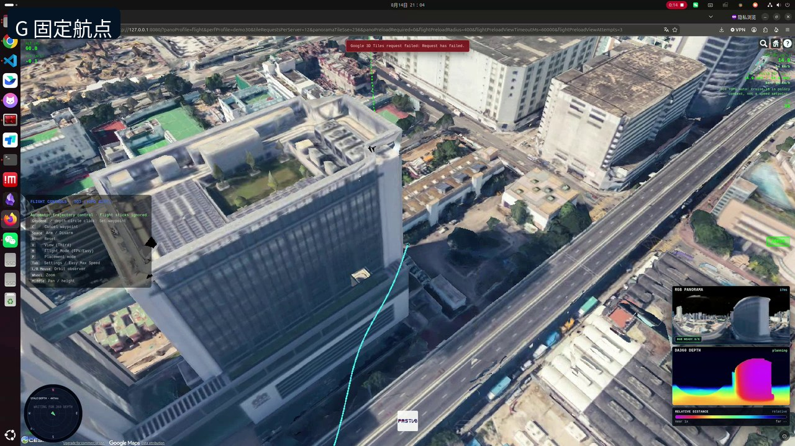
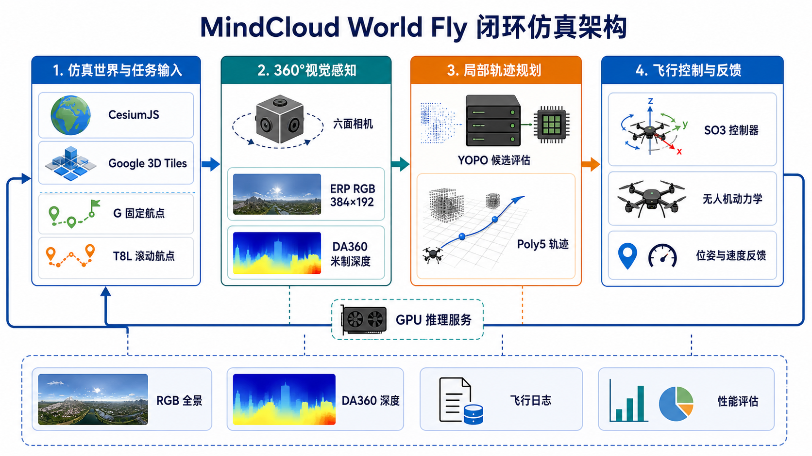
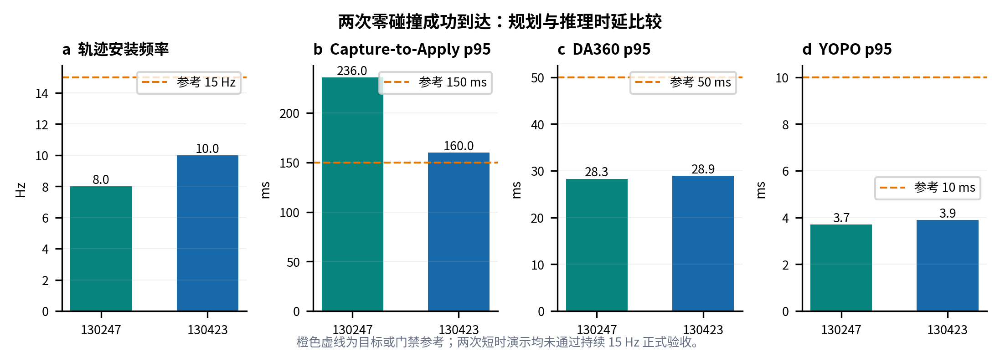

# MindCloud World Fly

**基于 CesiumJS、DA360 与 YOPO360 的浏览器无人机闭环仿真平台**

MindCloud World Fly 在浏览器中加载 Google Photorealistic 3D Tiles，以六面相机生成 360° ERP RGB，经 DA360 估计米制深度，再由 YOPO 生成 Poly5 局部轨迹，最后通过浏览器内 SO3 控制器闭环跟踪。项目同时支持键鼠、RadioMaster T8L、固定 G 航点和滚动遥控航点。

> 本仓库当前定位为研究与演示用仿真平台。下方日志证明了两次零碰撞成功到达，但不代表持续 15 Hz 规划门禁、真实飞行或安全认证已经通过。

## 功能概览

| 模块 | 当前能力 |
|---|---|
| 仿真世界 | CesiumJS + Google Photorealistic 3D Tiles |
| 视觉感知 | 六面相机、384×192 ERP RGB、DA360 米制深度 |
| 局部规划 | YOPO 候选评估与 Poly5 轨迹 |
| 飞行控制 | FPV、Drone (Easy)、SO3 固定航向控制 |
| 任务输入 | G 固定航点、T8L 50 m 滚动航点 |
| 诊断记录 | RGB/深度预览、飞行日志、规划与画面性能指标 |

## 视频演示

<table>
<tr>
<td align="center"> <b>FPV 手动飞行</b></td>
<td align="center"> <b>Drone (Easy)</b></td>
</tr>
<tr>
<td align="center"> <b>T8L 滚动航点</b></td>
<td align="center"> <b>G 固定航点</b></td>
</tr>
</table>

点击封面可打开 GitHub Release 中的 1080p MP4。仓库不提交原始录屏和完整飞行日志。

## 系统架构

系统把世界渲染、360°视觉、GPU 推理、轨迹规划和 SO3 控制组成闭环；可见预览是诊断支路，不应被当成 YOPO 实际规划频率。可检索的 Mermaid 图和模块说明见 [架构文档](docs/ARCHITECTURE.zh-CN.md)。

## 快速开始

### 1. 准备模型与容器

运行环境需要 NVIDIA GPU、驱动、NVIDIA Container Toolkit、Docker、Python 3、Node.js，以及可访问 Cesium Ion 和 Google 3D Tiles 的网络。

~~~bash
python3 scripts/verify_dependencies.py
docker build -f Dockerfile.da360-yopo -t mindcloud-da360-yopo:latest .
~~~

DA360 与 YOPO checkpoint 不随仓库分发。可通过环境变量指定位置：

~~~bash
DA360_MODEL_PATH_HOST=/path/to/DA360_large.pth \
YOPO_MODEL_PATH_HOST=/path/to/epoch10.pth \
./start-all.sh
~~~

Cesium Ion token 不写入仓库。首次使用某个浏览器配置时，在该浏览器开发者控制台执行一次：

~~~js
localStorage.setItem('mindcloud_cesium_ion_token', 'YOUR_CESIUM_ION_TOKEN');
location.reload();
~~~

Firefox 和 Chrome 使用不同的浏览器存储，需要分别配置。旧版本源码中曾公开过的 token 应在 Cesium Ion 后台撤销，而不是继续复用。

### 2. 启动服务和浏览器

~~~bash
./start-all.sh
./launch-firefox-gpu.sh
~~~

Firefox 适合完整演示；RadioMaster T8L 的 Web Serial 连接请使用：

~~~bash
./launch-chrome-gpu.sh
~~~

本机 Web 与推理服务分别监听 <code>127.0.0.1:8080</code> 和 <code>127.0.0.1:5688</code>，均不应暴露到公网。

### 3. 选择 YOPO 策略

默认策略为 <code>baseline</code>，对应 epoch10。可选的 70 m 感知/30 m 轨迹策略通过以下命令启用：

~~~bash
MINDCLOUD_YOPO_STRATEGY=d70_h30_epoch30 ./start-all.sh
~~~

### 4. 放置并飞行

1. 在 placement 模式按住 <code>I</code> 点击有效表面设置出生点。
2. 使用 <code>W/A/S/D</code> 微调，按 <code>O</code> 确认。
3. 在 SO3 模式按住 <code>G</code> 点击可通行表面设置目标；建筑物上、内部或未解析表面会被拒绝。
4. 使用 <code>C</code> 取消导航；飞行历史路径和目标标记可在 Tab 设置中控制显示。

完整的遥控器映射、三种模式、状态说明和故障排查见 [中文 User Guide](docs/USER_GUIDE.zh-CN.md)。

## 成功飞行证据

| 日志标识 | 到达 | 碰撞 | 轨迹安装频率 | Capture-to-Apply p95 |
|---|---:|---:|---:|---:|
| <code>20260814-130247</code> | 是 | 0 | 约 8 Hz | 约 236 ms |
| <code>20260814-130423</code> | 是 | 0 | 约 10 Hz | 约 160 ms |

两次日志均进入 4 m 到达半径且没有碰撞，但时长不足 60 秒、规划频率低于持续 15 Hz 目标，因此 <code>formal_gate_passed=false</code>。详细轨迹图见 [第一次飞行](docs/assets/figures/demo-flight-20260814-130247.png) 和 [第二次飞行](docs/assets/figures/demo-flight-20260814-130423.png)；脱敏指标见 [demo-flight-summary.json](docs/data/demo-flight-summary.json)。

可复现绘图：

~~~bash
python3 scripts/plot_demo_flights.py \
  flight-log-a.json flight-log-b.json \
  --output-dir docs/assets/figures \
  --summary docs/data/demo-flight-summary.json
~~~

## 控制约定

| 输入 | 行为 |
|---|---|
| Arm 三挡 | 低挡锁定，中挡和高挡解锁 |
| Mode 三挡 | 低挡 FPV，中挡 Drone (Easy)，高挡 SO3 |
| SO3 Roll/Pitch | 固定首帧世界航向下移动滚动航点 |
| SO3 Yaw | 控制固定的世界航向参考 |
| SO3 Throttle | 当前不接入 YOPO 高度输入，滚动航点保持当前高度 |
| T8L 滚动航点 | 水平范围 50 m，摇杆回中后保持最近目标 |
| G 航点 | 固定世界目标，进入约 4 m 半径后完成终端段并转入保持 |

## 文档

- [中文 User Guide](docs/USER_GUIDE.zh-CN.md)
- [系统架构与数据流](docs/ARCHITECTURE.zh-CN.md)
- [YOPO 策略选择](docs/yopo-strategy-selection.md)
- [贡献指南](CONTRIBUTING.md)
- [安全策略](SECURITY.md)

## 版本与分支

| 名称 | 用途 |
|---|---|
| <code>main</code> | 当前默认、效果最佳的公开演示版本 |
| <code>v0.1.0-demo.20260814</code> | 本 README 对应的演示 Release |
| <code>upstream-baseline-c6406dd</code> | 上游原始基线定位标签 |
| <code>archive/da360-prototype-c0b82d5-20260809</code> | 早期 DA360 原型归档 |

## 当前边界

- 当前深度标定只获准用于 sim-to-sim，不代表真实传感器米制精度。
- Google 3D Tiles 的完整性受网络、代理、缓存和视角覆盖影响；未加载区域不能视为可靠自由空间。
- 两次公开演示没有通过持续 15 Hz、60 秒完整验收门禁。
- 本项目不提供真实无人机飞行安全保证，不应直接用于人员或财产附近的自主飞行。
- Cesium Ion token、模型文件、原始日志、设备信息和个人路径不得提交到仓库。

## 许可证与第三方项目

本项目采用 [Apache License 2.0](LICENSE)。第三方软件、模型和外部数据服务的许可与来源见 [NOTICE](NOTICE)。Google Photorealistic 3D Tiles 由外部服务提供，不随仓库分发。

## 致谢

本项目基于 [superboySB/MindCloud_World_Fly](https://github.com/superboySB/MindCloud_World_Fly) 持续开发。遥控器与控制器算法实现参考了 [zwhhhhh9](https://github.com/zwhhhhh9/) 的相关公开工作。本项目的 YOPO_360 部分参考 [cn-ryw/YOPO_360](https://github.com/cn-ryw/YOPO_360)；该项目是在 [zwhhhhh9/YOPO_360 的 velocity_15ms 分支](https://github.com/zwhhhhh9/YOPO_360/tree/velocity_15ms) 基础上进一步优化修改。感谢 DA360、YOPO、CesiumJS 等相关开源项目和研究工作。
