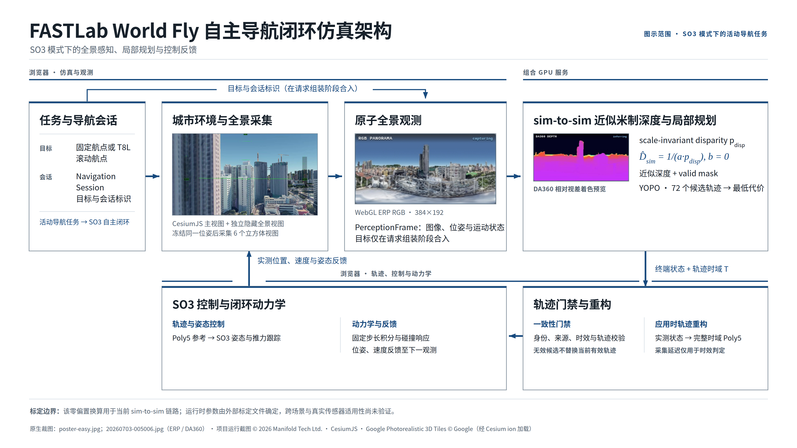
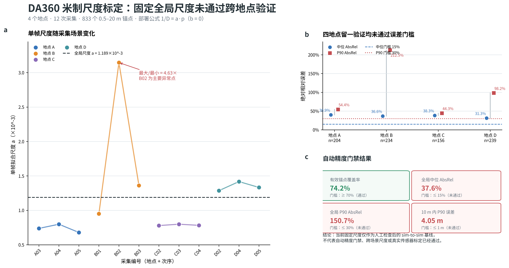

# FASTLab World Fly

**ZJU FAST Lab 城市高速无人机研究项目：基于 CesiumJS、DA360 与 YOPO360 的浏览器闭环仿真平台**

FASTLab World Fly 在浏览器中加载 Google Photorealistic 3D Tiles，以六面相机生成 360° ERP RGB，经 DA360 估计 scale-invariant 相对视差，再通过 `b=0` 的 scale-only 仿真标定转换为近似米制深度；YOPO 随后生成 Poly5 局部轨迹，最后由浏览器内 SO3 控制器闭环跟踪。项目同时支持键鼠、RadioMaster T8L、固定 G 航点和滚动遥控航点。

Google 将 Photorealistic 3D Tiles 定义为以卫星与航拍影像纹理化的三维网格（[Map Tiles API overview](https://developers.google.com/maps/documentation/tile/overview)）。这类真实世界影像驱动的城市表示能够呈现比少量手工布置的规则楼宇更复杂、更不规则的建筑分布，为城市高速无人机感知、规划与控制研究提供更有挑战性的仿真环境。

浏览器端架构也为手机、平板和笔记本电脑上的轻量访问留下了潜力，但移动端目前尚未完成：系统仍依赖本机回环 Web/推理服务、NVIDIA GPU 推理、键盘或遥控器输入，并且没有触屏飞控适配。当前可复现目标仍是具备 NVIDIA GPU 的桌面 Linux 环境。

> 本项目用于仿真研究与演示。下方两段日志记录了零碰撞到达案例；持续 15 Hz 规划、真实飞行和安全认证仍未完成。

## 功能概览

| 模块 | 当前能力 |
|---|---|
| 仿真世界 | CesiumJS + Google Photorealistic 3D Tiles |
| 视觉感知 | 六面相机、384×192 ERP RGB、DA360 相对视差、`1/D=a·p`（`b=0`）近似米制标定 |
| 局部规划 | YOPO 候选评估与 Poly5 轨迹 |
| 飞行控制 | FPV、Drone (Easy)、Level、SO3 固定航向控制 |
| 任务输入 | G 固定航点、T8L 50 m 滚动航点 |
| 诊断记录 | RGB/深度预览、飞行日志、规划与画面性能指标 |

## 视频演示

<table>
<tr>
<td align="center"> <b>FPV 手动飞行</b></td>
<td align="center"> <b>Drone (Easy)</b></td>
</tr>
<tr>
<td align="center"> <b>T8L 滚动航点</b></td>
<td align="center"> <b>G 固定航点</b></td>
</tr>
</table>

点击封面可打开 GitHub Release 中的 1080p MP4。仓库不提交原始录屏和完整飞行日志。

## 系统架构

[SVG 矢量图](docs/assets/architecture/fastlab-world-fly-system-architecture.svg) · [PDF](docs/assets/architecture/fastlab-world-fly-system-architecture.pdf) · [HTML 预览](docs/assets/architecture/fastlab-world-fly-system-architecture.html) · [Mermaid 与模块说明](docs/ARCHITECTURE.zh-CN.md)

主图只保留 SO3 模式下活动导航任务的控制闭环：任务身份通过独立总线在请求组装阶段与不可变 `PerceptionFrame` 合入，经 DA360 sim-to-sim 零偏置尺度换算和 YOPO 局部规划后，通过时效与一致性门禁；浏览器再从应用时实测状态构造完整时域 Poly5，由 SO3 控制器和固定步长动力学执行并反馈状态。手动模式、缓存预览、日志、离线标定和评测移至 [架构文档](docs/ARCHITECTURE.zh-CN.md)，不与控制主链混画。三幅画面均裁自项目运行截图，其余元素为原生 SVG 几何和可检索文字。

## 快速开始

### 1. 准备模型与容器

运行环境需要 NVIDIA GPU、驱动、NVIDIA Container Toolkit、Docker、Python 3、Node.js，以及可访问 Cesium Ion 和 Google 3D Tiles 的网络。

~~~bash
python3 scripts/verify_dependencies.py
docker build -f Dockerfile.da360-yopo -t mindcloud-da360-yopo:latest .
~~~

DA360 与 YOPO checkpoint 不随仓库分发。可通过环境变量指定位置：

~~~bash
DA360_MODEL_PATH_HOST=/path/to/DA360_large.pth \
YOPO_MODEL_PATH_HOST=/path/to/epoch30.pth \
./start-all.sh
~~~

Cesium Ion token 不写入仓库。首次开始飞行时，页面会显示 token 配置框；输入一个限制到本机来源的有效 token 后，页面会将它保存在当前浏览器配置中并直接继续。`launch-firefox-gpu.sh` 使用独立、持久、非隐私的项目 profile，因此后续启动无需重复输入。

Firefox 和 Chrome 使用不同的浏览器存储，需要分别配置。该配置流程不会把 token 写入应用页面 URL、浏览器启动命令或应用主动日志；旧版本源码中曾公开过的 token 应在 Cesium Ion 后台撤销，而不是继续复用。

### 2. 启动服务和浏览器

~~~bash
./start-all.sh
./launch-firefox-gpu.sh
~~~

Firefox 适合完整演示；RadioMaster T8L 的 Web Serial 连接请使用：

~~~bash
./launch-chrome-gpu.sh
~~~

本机 Web 与推理服务分别监听 <code>127.0.0.1:8080</code> 和 <code>127.0.0.1:5688</code>，均不应暴露到公网。

### 3. 选择 YOPO 策略

默认策略为 <code>d70_h30_epoch30</code>，对应 epoch30、70 m 感知和 30 m 最大轨迹距离。如需使用原有 epoch10 基线策略，可显式切换：

~~~bash
MINDCLOUD_YOPO_STRATEGY=baseline ./start-all.sh
~~~

### 4. 放置并飞行

1. 在 placement 模式按住 <code>I</code> 点击有效表面设置出生点。
2. 使用 <code>W/A/S/D</code> 微调，按 <code>O</code> 确认。
3. 在 SO3 模式按住 <code>G</code>，可点击已解析的地面、建筑屋顶或立面取得水平坐标；目标沿用当前高度，也可在按住 <code>G</code> 时用滚轮指定高度。系统会在最终高度按“无人机碰撞半径 + 0.2 m”净空校验，建筑内部、表面、净空不足或目标处几何未解析时拒绝。左下角深度小地图可直接单击设置同规则目标，无需按 <code>G</code>。
4. 使用 <code>C</code> 取消导航；飞行历史路径可在 Tab 设置中控制显示或点击 <b>Clear</b> 从当前位置重新记录，目标标记也可在此控制显示。

完整的遥控器映射、状态说明和故障排查见 [中文 User Guide](docs/USER_GUIDE.zh-CN.md)。浏览器下拉框提供 FPV、Drone (Easy)、Level、SO3 四种模式；T8L 的 Mode 三挡默认映射 FPV、Easy、SO3。

## 成功飞行证据

| 日志标识 | 到达 | 碰撞 | 轨迹安装频率 | Capture-to-Apply p95 |
|---|---:|---:|---:|---:|
| <code>20260814-130247</code> | 是 | 0 | 约 8 Hz | 约 236 ms |
| <code>20260814-130423</code> | 是 | 0 | 约 10 Hz | 约 160 ms |

两次日志均进入 4 m 到达半径且没有碰撞，但时长不足 60 秒、规划频率低于持续 15 Hz 目标，因此 <code>formal_gate_passed=false</code>。详细轨迹图见 [第一次飞行](docs/assets/figures/demo-flight-20260814-130247.png) 和 [第二次飞行](docs/assets/figures/demo-flight-20260814-130423.png)；脱敏指标见 [demo-flight-summary.json](docs/data/demo-flight-summary.json)。

可复现绘图：

~~~bash
python3 scripts/plot_demo_flights.py \
  flight-log-a.json flight-log-b.json \
  --output-dir docs/assets/figures \
  --summary docs/data/demo-flight-summary.json
~~~

## 控制约定

| 输入 | 行为 |
|---|---|
| Arm 三挡 | 低挡锁定，中挡和高挡解锁 |
| Mode 三挡 | 低挡 FPV，中挡 Drone (Easy)，高挡 SO3 |
| SO3 Roll/Pitch | 固定首帧世界航向下移动滚动航点 |
| SO3 Yaw | 控制固定的世界航向参考 |
| SO3 Throttle | 当前不接入 YOPO 高度输入，滚动航点保持当前高度 |
| T8L 滚动航点 | 水平范围 50 m，摇杆回中后保持最近目标 |
| G 航点 | 点击地面、屋顶或立面取水平坐标，按当前/滚轮高度校验三维净空；左下小地图单击无需按 G |

## 文档

- [中文 User Guide](docs/USER_GUIDE.zh-CN.md)
- [系统架构与数据流](docs/ARCHITECTURE.zh-CN.md)
- [YOPO 策略选择](docs/yopo-strategy-selection.md)
- [贡献指南](CONTRIBUTING.md)
- [安全策略](SECURITY.md)

## 版本与分支

| 名称 | 用途 |
|---|---|
| <code>main</code> | 当前默认、效果最佳的公开演示版本 |
| <code>v0.1.0-demo.20260814</code> | 本 README 对应的演示 Release |
| <code>upstream-baseline-c6406dd</code> | 上游原始基线定位标签 |
| <code>archive/da360-prototype-c0b82d5-20260809</code> | 早期 DA360 原型归档 |

## DA360 米制标定数据

当前运行时采用 scale-only 关系 `1/D=a·p`，固定 `b=0`。12 次采集的有效锚点覆盖率达到 74.2%，但单帧尺度差异和四地点留一验证误差均表明：一个固定全局尺度尚未通过自动精度门禁。现有配置仅作为人工检查后的 sim-to-sim 基线，不代表真实传感器或跨场景米制精度已经通过。

[可编辑 SVG](docs/assets/figures/da360-metric-calibration.zh-CN.svg) · [PDF](docs/assets/figures/da360-metric-calibration.zh-CN.pdf) · [脱敏摘要数据](docs/data/da360-metric-calibration-summary.json) · [绘图脚本](scripts/plot_da360_metric_calibration.py) · [详细仿真标定图与源数据](docs/research/da360-sim-calibration/README.zh-CN.md)

## 当前边界

- 当前深度标定只获准用于 sim-to-sim，不代表真实传感器米制精度。
- Google 3D Tiles 的完整性受网络、代理、缓存和视角覆盖影响；未加载区域不能视为可靠自由空间。
- ICRA 论文或宣传材料发布前必须单独核对当前 Cesium Ion/Google 服务合同是否允许将渲染内容用于 DA360/YOPO 机器解释，并审查动态署名和宣传视频要求；本仓库不把现有实现表述为已经完成该合规审查（[Map Tiles API policies](https://developers.google.com/maps/documentation/tile/policies)）。
- 手机和平板访问目前只是架构潜力；回环服务、GPU 推理、键盘/遥控器依赖和缺少触控适配仍阻止移动端开箱即用。
- 两次公开演示没有通过持续 15 Hz、60 秒完整验收门禁。
- 本项目不提供真实无人机飞行安全保证，不应直接用于人员或财产附近的自主飞行。
- Cesium Ion token、模型文件、原始日志、设备信息和个人路径不得提交到仓库。

## 许可证与第三方项目

本项目采用 [Apache License 2.0](LICENSE)。第三方软件、模型和外部数据服务的许可与来源见 [NOTICE](NOTICE)。Google Photorealistic 3D Tiles 由外部服务提供，不随仓库分发；运行界面显式要求 Cesium 将当前瓦片的动态署名显示在屏幕上，项目 logo 不得遮挡这些署名。

## 致谢

本项目的早期代码源自 [superboySB/MindCloud_World_Fly](https://github.com/superboySB/MindCloud_World_Fly)，现由 FASTLab World Fly 独立维护；原始作者与 Manifold Tech Ltd. 的版权声明、Git 提交历史和 `upstream-baseline-c6406dd` 基线标签均予保留。遥控器算法实现参考了 [zwhhhhh9](https://github.com/zwhhhhh9/) 的相关公开工作。本项目的 YOPO_360 部分参考 [cn-ryw/YOPO_360](https://github.com/cn-ryw/YOPO_360)；该项目是在 [zwhhhhh9/YOPO_360 的 velocity_15ms 分支](https://github.com/zwhhhhh9/YOPO_360/tree/velocity_15ms) 基础上进一步优化修改。感谢 DA360、YOPO、CesiumJS 等相关开源项目和研究工作。
