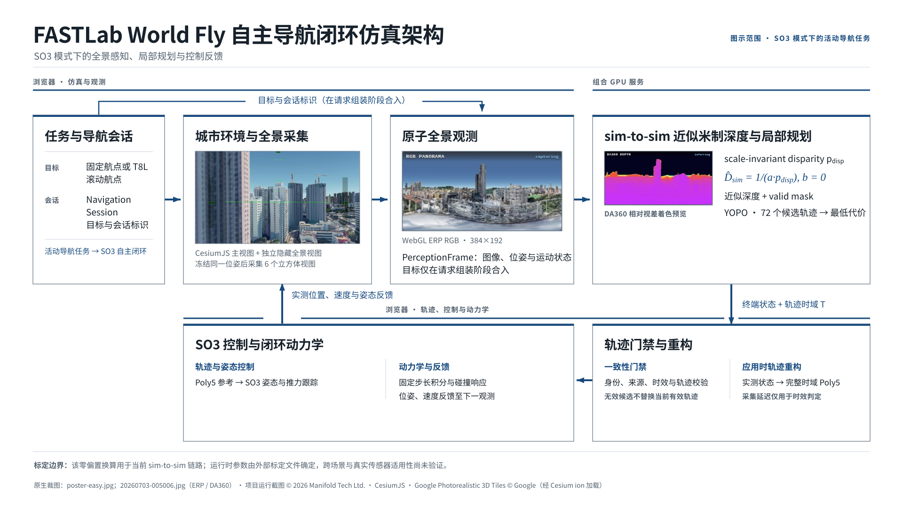

# FASTLab World Fly 系统架构

[SVG 矢量图](assets/architecture/fastlab-world-fly-system-architecture.svg) · [PDF](assets/architecture/fastlab-world-fly-system-architecture.pdf) · [HTML 预览](assets/architecture/fastlab-world-fly-system-architecture.html)

页首主图只呈现 SO3 模式下活动导航任务的控制闭环，以保持箭头方向、进程边界和状态反馈清晰。下方 Mermaid 再展开手动模式、预览、标定、日志和失败关闭路径：实线表示控制主链，虚线表示诊断或离线研究。诊断画面和被阻止、过期、拒绝的规划响应都不计入有效规划频率。

## 可检索架构图

~~~mermaid
flowchart LR
    subgraph BROWSER["浏览器：任务、仿真、采集与控制"]
        TASK["输入与任务 键鼠/遥控器 G/深度雷达固定航点 · T8L 50 m 滚动航点"]
        SESSION["Navigation Session goal + goalId / generation Drone + PanoramaSensor + FlightLogger"]
        MANUAL["手动控制分支 FPV / Easy / Level 绕过 DA360 与 YOPO"]
        WORLD["CesiumJS 1.117 Google Photorealistic 3D Tiles"]
        CAMERA["隐藏六面相机 六面完整帧 → ERP 384×192"]
        FRAME["不可变 PerceptionFrame RGB + 投影配置 + capture 状态/yaw frameId"]
        COMMIT{"身份、时效与事务门禁 诊断契约 + Poly5 连续区间校验"}
        POLY5["应用时实测 p/v + 旧参考 a 重新拟合完整时长 Poly5 d70 默认 T = 1.875 s，initialTime = 0"]
        SO3["SO3 直接加速度跟踪 25 m/s²、60° 倾角与总推力约束"]
        UAV["200 Hz 固定步长 无人机动力学与碰撞检测"]
        STATE["实际位姿/速度 + 轨迹参考状态 仿真时间"]
    end

    subgraph SERVICE["本机组合推理服务：127.0.0.1:5688"]
        FULL["POST /yopo/plan_full RGBA8 ERP + 投影头 + 冻结观测 frame / goal / generation 身份"]
        DA360["DA360 scale-invariant disparity"]
        DEPTH["深度模式 relative：仅预览 metric：D = 1/(a·p)，b = 0"]
        AUTH{"结构规划授权 da360-metric + calibration ID YOPO 已初始化"}
        YIN["YOPO 输入 384×192×2：深度归一化 + valid mask 9D 状态：[v, a, goal]"]
        YOPO["默认 d70_h30_epoch30 6×12×1 = 72 候选 argmin score"]
        RESULT["轴主序 endstate + traj_time 候选诊断 + calibration/service 身份"]
    end

    subgraph EXCEPT["失败关闭与控制回退"]
        BLOCK["blocked 不运行 YOPO、不返回可应用轨迹"]
        STALE["stale / identity mismatch 超龄或越过 apply deadline"]
        REJECT["rejected 响应、诊断或 Poly5 不合法"]
        ERROR["error / offline HTTP、JSON 或后端运行失败"]
        KEEP["不发布候选、不破坏旧有效轨迹 无轨迹或轨迹耗尽：hold + 请求重规划"]
    end

    subgraph DIAG["不参与控制的诊断与研究支路"]
        CACHE["按 frame/goal/generation 缓存深度 latest-only 异步着色/JPEG"]
        PREVIEW["RGB PANORAMA / DA360 DEPTH /depth 或 /yopo/preview"]
        LOG["FlightLogger + evaluator 控制 outcome 与画布 outcome 分离"]
        CALIB["calibration profile 稀疏 Cesium ray anchors + 离线拟合"]
    end

    TASK -->|固定或滚动目标| SESSION
    TASK -->|手动模式| MANUAL --> UAV
    SESSION -->|goal + identity| FULL
    STATE --> WORLD
    WORLD --> CAMERA --> FRAME
    FRAME --> FULL --> DA360 --> DEPTH --> AUTH
    AUTH -->|authorized| YIN --> YOPO --> RESULT --> COMMIT
    COMMIT -->|fresh and valid| POLY5 --> SO3 --> UAV --> STATE
    STATE --> FRAME

    AUTH -->|relative / 缺 calibration / YOPO 未就绪| BLOCK --> KEEP
    FRAME -->|完整帧过旧| STALE
    FULL -->|response identity 异常| STALE
    FULL -->|HTTP / JSON / 后端异常| ERROR
    COMMIT -->|deadline 前后检查失败并回滚| STALE
    COMMIT -->|endstate / diagnostics / 连续极值非法| REJECT
    STALE --> KEEP
    REJECT --> KEEP
    ERROR --> KEEP

    FRAME -.->|无目标：/depth| PREVIEW
    DEPTH -.->|低频、profile-dependent demo30 至多 2 Hz| CACHE
    CACHE -.->|GET /yopo/preview，不重复 DA360| PREVIEW
    WORLD -.->|静态标定采集| CALIB
    CALIB -.->|只写入受审查的 b=0 标定| DEPTH
    FRAME -.-> LOG
    RESULT -.-> LOG
    COMMIT -.-> LOG
    UAV -.-> LOG
    BLOCK -.-> LOG
    STALE -.-> LOG
    REJECT -.-> LOG
    ERROR -.-> LOG
~~~

`planning_authorized=true` 只是结构授权，不等于标定精度已经通过。挂载的 metric calibration 即使报告 `accuracy_accepted=false`，组合服务仍可返回 `planning_authorized=true` 和 `planning_reason=experimental-unaccepted-da360-metric`。仓库中已发布的 sim-to-sim 脱敏基线正是这种未通过自动精度门禁的状态；具体运行实例仍须用 calibration ID、acceptance 字段和 health 响应核对，不能写成“已验证米制深度”。

## 模块边界

| 子系统 | 当前职责 | 明确不承担的职责 |
|---|---|---|
| 任务与交互 | G 点击或深度雷达点击设置固定世界航点；T8L 在固定世界航向下更新约 50 m 滚动航点 | 这些任务入口不是新的飞行模式，也不直接生成控制力 |
| Navigation Session | 在浏览器内生成并同步 goal、`goalId/generation`，设置 Drone 与 PanoramaSensor，并启动 FlightLogger | 任务输入不会绕过浏览器会话直接调用推理服务 |
| 手动控制模式 | FPV、Drone (Easy) 与 Level 在浏览器内直接形成手动控制分支 | 不进入 DA360/YOPO 规划链；只有 SO3 + active goal 才消费 YOPO 轨迹 |
| Cesium 主视图 | 显示城市、无人机、目标和飞行路径，并接收任务交互 | 不直接向 YOPO 提供稠密深度真值 |
| 隐藏全景视图与六面相机 | 同步无人机状态，依次渲染六个方向并投影为 `384×192` ERP | “RGB 6/6”不代表主视图或隐藏视图的所有 3D Tiles 已加载完整 |
| `PerceptionFrame` | 原子绑定 RGB、capture wall/sim time、相机变换、实际/参考状态、yaw、投影配置和帧身份 | 不用回包时的新状态替换冻结的规划观测 |
| `/yopo/plan_full` | 一次请求内解码图像、运行 DA360、执行规划授权并在获准时运行 YOPO | 控制响应固定 `include_preview=0`，不承担前端画布解码和显示 |
| DA360 与 scale-only 标定 | 输出 scale-invariant disparity；metric 模式按 `D=1/(a·p)`、`b=0` 转为近似米制深度 | 不承诺真实传感器或跨场景的天然米制精度；relative 模式不能驱动当前 YOPO |
| YOPO `d70_h30_epoch30` | 使用深度、mask、状态和目标评估 72 个候选，返回最低代价候选的世界系终端状态 | 不输出浏览器可直接积分的电机/姿态命令，也不推进物理状态 |
| 浏览器轨迹消费端 | 验证身份、时效、端点和完整 Poly5 区间；以应用时实测状态构造私有候选并原子发布 | 不把 capture age 快进为轨迹后缀；非法候选不能清除仍有效的旧轨迹 |
| SO3 与无人机动力学 | 读取 Poly5 参考加速度，执行加速度、倾角、推力、姿态和角速度约束，在 200 Hz 固定时基推进状态 | 不替代 YOPO 做障碍物候选选择 |
| 诊断与评估 | 缓存 RGB/深度预览，记录请求身份、模型/标定身份、候选、控制饱和和分段时延 | preview、blocked、stale、ignored、rejected 均不能冒充 `trajectoryApplied=true` |

## 默认 YOPO 策略与规划契约

`start-all.sh` 当前默认 `MINDCLOUD_YOPO_STRATEGY=d70_h30_epoch30`。只有显式设置 `MINDCLOUD_YOPO_STRATEGY=baseline` 才切换到 epoch10 基线。

| 参数 | `d70_h30_epoch30` 当前值 |
|---|---:|
| checkpoint | `epoch30.pth` |
| 网络输入 | `384×192×2`，metric depth + valid mask |
| 有效深度范围 | 0.04–70 m |
| 候选网格 | `6×12×1 = 72` |
| 最大局部轨迹距离 | `2×radio_range = 30 m` |
| 规划时域 | `T=2×15/16=1.875 s` |
| 巡航目标 | 15 m/s |
| 训练期最大加速度 | 12 m/s² |
| 浏览器控制硬上限 | 25 m/s² |

YOPO 的网络观测为 9 维 `[v_xyz, a_xyz, goal_xyz]`。服务端将预测分数展平后取 `argmin`，因为 score 是代价而不是置信度；返回的公开终端状态固定为轴主序：

~~~text
[px, vx, ax,  py, vy, ay,  pz, vz, az]
~~~

原始 `selected_endstate_raw` 是 lattice 解码前的 9 个归一化系数，不能当成世界系终端状态。只有顶层 `endstate` 才是 sim Y-up 世界坐标中的绝对端点。

## PerceptionFrame、时效与原子发布

采集开始时，传感器冻结 `actualState`、`referenceState`、yaw 和 simulation time；六面图完成后，RGB 与这些字段共同进入同一个不可变 `PerceptionFrame`。规划请求分别传递实际位置与参考位置：实际位置用于世界端点解码，参考位置用于网络中的相对目标观测。

同一 goal generation 内，传感器使用 latest-slot 继续接收新完整帧，但同一时刻只允许一个控制请求占用 gate。应用前依次检查：

1. `goalId / generation / frameId` 与当前导航会话及响应一致。
2. depth mode、calibration ID、service session ID 和 `planning_diagnostics v1` 存在且结构合法。
3. capture 到 commit 未超过 250 ms 硬时效，事务在 deadline 前后各检查一次；跨过 deadline 的刚发布轨迹会按相同不可变身份同步回滚。
4. 控制端还要求 planning age 不超过 `min(0.25 s, 0.25T)`。
5. 终端状态、时长、位移、速度、加速度有限，并对完整连续 Poly5 区间求速度和加速度极值；不是只抽样端点。

所有校验先在私有 `YopoTrajectoryTracker` 上完成，最后才替换活动轨迹。因此坏响应或过期响应不会先清空一条仍可执行的旧轨迹。

## 应用时完整时长 Poly5

服务端返回绝对终端状态和 `traj_time`，不返回 Poly5 系数。当前消费端遵循 YOPO `plan_from_reference=False` 的交接方式：

1. capture 状态用于网络观测、身份追踪和 planning-age 门禁。
2. 响应通过门禁后，浏览器读取应用瞬间的实测位置、速度，以及旧活动轨迹的当前参考加速度。
3. 从这个应用时起点到服务端终端状态重新拟合一条五次多项式，并设置 `initialTime=0`、`expirySimTime=applySimTime+T`。
4. 控制器执行完整的 `T`，不会按 capture-to-apply 延迟 fast-forward，也不会只执行原 capture-time 多项式的 suffix。

每一轴的参考为：

$$
q(t)=A_0+A_1t+A_2t^2+A_3t^3+A_4t^4+A_5t^5,
$$

六个系数由应用时起点与服务端终点的 `p/v/a` 六个边界条件确定。这个语义与旧文档中的“冻结 capture-time Poly5 后快进到剩余后缀”不同；后者不再描述当前代码。

## 控制反馈与到达逻辑

活动轨迹只向 SO3 跟踪器提供直接参考加速度，不叠加沿轨迹的位置/速度误差反馈：

$$
\mathbf F_d=m\left(g\mathbf e_{up}+\mathbf a_{ref}\right).
$$

控制端先把参考加速度限制在 25 m/s²，再执行 60° 总倾角和最大推力约束，生成期望姿态并通过 reduced-quaternion / rate servo 更新机体姿态。物理状态以 `dt=0.005 s` 的固定时基推进，然后反馈给 Cesium、下一次 `PerceptionFrame` 和日志。

固定 G 航点当前采用简单的产品级到达规则：

~~~mermaid
flowchart LR
    ACTIVE["持续感知、规划与 Poly5 跟踪"] --> CHECK{"实测三维距离 ≤ 4 m?"}
    CHECK -->|否| ACTIVE
    CHECK -->|是| TERMINAL["terminal-track 停止新规划并拒绝后续轨迹"]
    TERMINAL --> FINISH["仅让已安装的 Poly5 执行到末端"]
    FINISH --> HOLD["锁存实际末端并进入 SO3 hold"]
~~~

该路径不再要求 `speed≤0.75 m/s`、0.4 s dwell、预测制动包络或第二次距离检查。T8L 滚动目标不进入这个固定航点到达状态；摇杆更新目标时继续快速重规划。

## 异常路径

| 条件 | 结果分类 | 当前行为 |
|---|---|---|
| 尚无完整六面 RGB / 尚无位姿 | awaiting | 不发规划请求，继续等待完整 `PerceptionFrame` |
| capture 在 fetch 前已无足够预算，或 commit 越过 250 ms deadline | stale | 中止或回滚该身份的发布，不覆盖旧有效轨迹 |
| goal/generation/planning epoch 已变化，或响应回显的 frame 身份不匹配 | stale | 丢弃响应，禁止旧导航会话或错误帧身份取得控制权；仅仅完成了更新的 RGB 帧不会自动作废仍在时限内的请求 |
| `da360-relative`、缺失 calibration ID、YOPO 未初始化 | blocked | 返回 `planning_authorized=false`；不运行 YOPO、不返回可应用 endstate |
| DA360 未初始化、HTTP/JSON 或后端执行失败 | error / offline | 不发布轨迹，记录错误；旧有效轨迹仍由控制端持有 |
| `accuracy_accepted=false` 但 metric 结构完整 | applied 或后续门禁结果 | 允许实验性结构授权，同时保留 `experimental-unaccepted-da360-metric` 标识 |
| diagnostics 缺失、endstate 非法、时长/连续极值超限 | rejected | 私有候选不发布；旧活动轨迹保持不变 |
| handler 在 commit 中抛错或跨 deadline | rejected / stale | 事务失败；按相同 request identity compare-and-clear 回滚 |
| 非到达状态下活动轨迹耗尽且没有新轨迹 | control fallback | 锁存当前位置、进入 failsafe hold，并请求继续重规划 |
| 瓦片碰撞 | control fallback | 清除活动轨迹、进入 SO3 hold 并请求重规划；碰撞几何只来自当前已加载渲染数据的保守代理 |
| T8L 输入超过 250 ms 未更新或连接丢失 | link-loss fallback | 不延续陈旧杆量；取消当前导航会话与航点并锁存 SO3 hold |
| 已进入 4 m 固定航点到达半径 | ignored | 后续规划不再取得控制权；完成已安装段后 hold |
| preview 缓存、着色、JPEG 或 canvas 解码失败 | depth-preview error | 只影响诊断画面，不撤销已经成功发布的控制轨迹 |

## 诊断、预览与标定支路

- 无导航目标时，`/depth` 可独立运行 DA360 并更新深度画布；它不运行 YOPO。
- 导航期间，`/yopo/plan_full` 固定 `include_preview=0`，避免把 polar reduction、着色、JPEG/base64 和画布解码放入控制关键路径。
- `prepare_preview=1` 的节流频率随 performance profile 配置：当前默认 `demo30` 最短间隔 500 ms，即至多 2 Hz；显式 `baseline` 为 2000 ms。服务端按精确的 `frame/goal/generation` 缓存同一次规划深度，在 latest-only 后台 worker 中着色编码；前端随后请求 `/yopo/preview`，不会再次运行 DA360。
- `FlightLogger` 把 control outcome 与 canvas outcome 分开。正式 evaluator 只统计唯一且 `planningAuthorized=true`、`trajectoryApplied=true` 的实际安装帧。
- calibration profile 与活动导航互斥。它从冻结帧导出 ERP、投影元数据和稀疏 Cesium ray anchors；当前没有稠密 Cesium depth 进入在线规划主链。

部署关系固定为：

$$
D_{metric}=\frac{1}{a\,p_{disp}},\qquad b=0.
$$

`a` 从启动时只读挂载的 calibration 文件读取，不能仅凭仓库摘要推断当前运行实例的数值；必须同时核对 calibration ID 和 health 返回的 acceptance provenance。affine `1/D=a·p+b` 只允许离线诊断，非零 `b` 不得写入运行时配置。

仓库脱敏摘要发布过一个可追溯的 sim-to-sim 基线：`a=0.0011892812185910185`、`b=0`。它来自 12 次仿真采集，自动精度门禁未通过；该数值只能标为“已发布实验基线”，不能冒充当前实例参数或真实传感器标定。

## 坐标与航向

- 浏览器仿真世界是 `(x,y,z)=(east,up,north)`，即 Y-up。
- YOPO 世界使用 `(east,north,up)`；bridge 在进入/离开网络时交换 sim 的 `y/z`。
- ERP 射线所用 NWU 是相机/传感器局部坐标：`+x` forward、`+y` left、`+z` up，不能与全局 sim 世界坐标混写。
- sim yaw 转为 YOPO yaw：`yaw_yopo=deg2rad(-yaw_sim-90°)`。
- SO3 模式进入时保存固定世界 yaw；Roll/Pitch 在该世界航向下移动滚动航点，Yaw 修改世界航向参考，当前 Throttle 不写入 YOPO 高度目标。

## 未接入当前实线闭环的工具

仓库仍保留 Gate/race HUD、路径编辑与 `path-store` 等可选或迁移期代码，但当前 `main.js` 没有构造 GateCourse，也没有把这些工具接入 Navigation Session、`PerceptionFrame` 或 `/yopo/plan_full`。它们不属于图中的控制关键路径，不能据此推断当前自主闭环会沿预编辑路径或按赛门序列规划。
